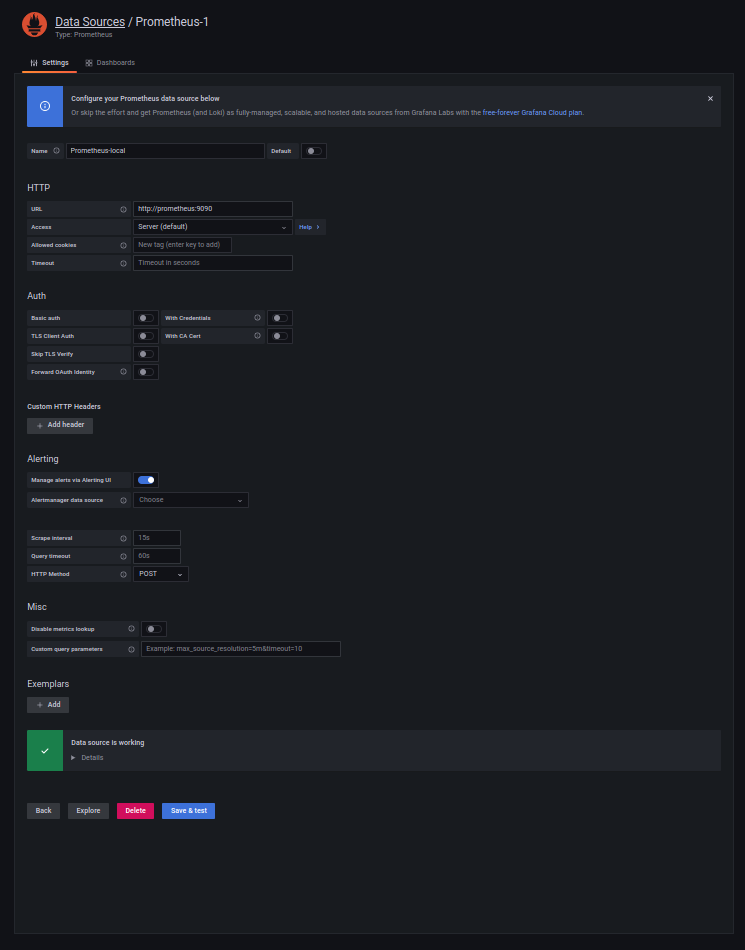
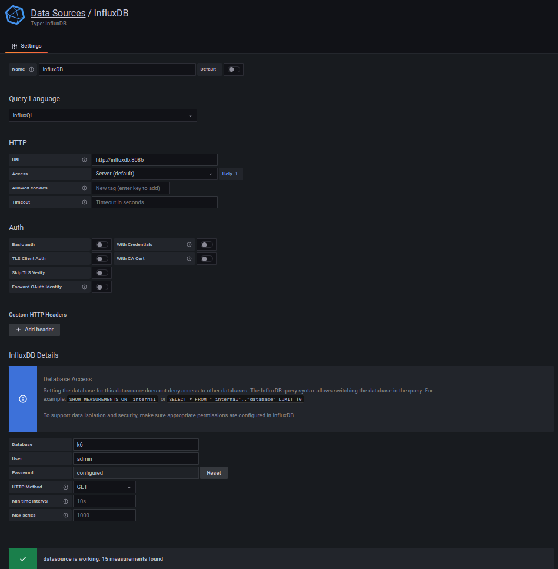
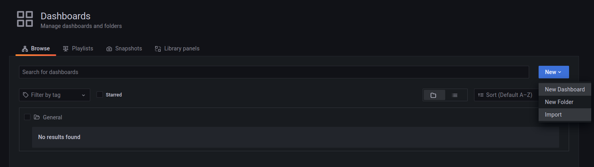

# Load Testing and Visualization using k6, Prometheus and Grafana

Tools used:

- Prometheus
- Prometheus/node_exporter
- Grafana
- InfluxDB
- k6

&nbsp;

## Setup and Running the test

Create .env file by copying .env-example. Change the variable value as you wish.

`cp .env-example .env`

Run the docker compose file. Add `-d` at the end if you want to run it in detached mode.

`docker-compose up -d`

Run the demo test script using following command:

`docker-compose run k6 run /tests/script.js`

**Note: For detail grafana setup see [Grafana Setup](#grafana-setup) setction below**

&nbsp;

## Notes:

- All this is setup in our local machine only
- The system metrcis collected by node_exporter is from our localhost, as it installed locally
- To collect the system metrics from another server we need to install node_exporter to that server and configure it in prometheus.yml
- The API endpoint used in this demo is "http://test.k6.io" (provided by k6). So, the API metrics collected is for this endpoint.

&nbsp;

## Prometheus

Open source systems monitoring and alerting toolkit. It collects and stores its metrics as time series data, i.e. metrics information is stored with the timestamp at which it was recorded, alongside optional key-value pairs called labels.

Docker Network URL: http://prometheus:9090

Local URL: http://localhost:9090

&nbsp;

## Prometheus/node_exporter

Prometheus exporter for hardware and OS metrics. Collects metrics and exposes them to an endpoint, which Prometheus can consume.

&nbsp;

## Grafana

It is an open source data visualization tool developed by Grafana Labs (which also developed K6). It allows us to query, visualize, alert on and understand metrics from multiple sources into a single centralized location.

Docker Network URL: http://grafana:9091

Local URL: http://localhost:9091

&nbsp;

## InfluxDB v1.x.x

The Time Series Database for storage and retrival of time series data like application metrics, system metrics, IoT sensor data etc.

Docker Network URL: http://influxdb:8086

Local URL: http://localhost:8086

&nbsp;

## k6

Open source load testing tool for testing the performance of your backend infrastructure.

- Written in Go for faster performance
- Test Script is written in javascript

&nbsp;

# Grafana Setup

Go to Grfana URL and login using the username and password provided in .env file.
http://localhost:9091

**Add Prometheus data source using following settings**

**Add influxdb data source using following settings**

Use usename and password as defined in .env file.

Note: If there is no data in influxdb then it might show error which is fine for now.

**Import Dashboard Developed by community or build your own**
Explore dashboard from [Graphana Dashboards](https://grafana.com/grafana/dashboards/) and import as required using Dashboard ID.

Suggested dashboard:

- [Node Exporter Full](https://grafana.com/grafana/dashboards/1860-node-exporter-full/)
- [k6 Load Testing Results](https://grafana.com/grafana/dashboards/2587-k6-load-testing-results/)
